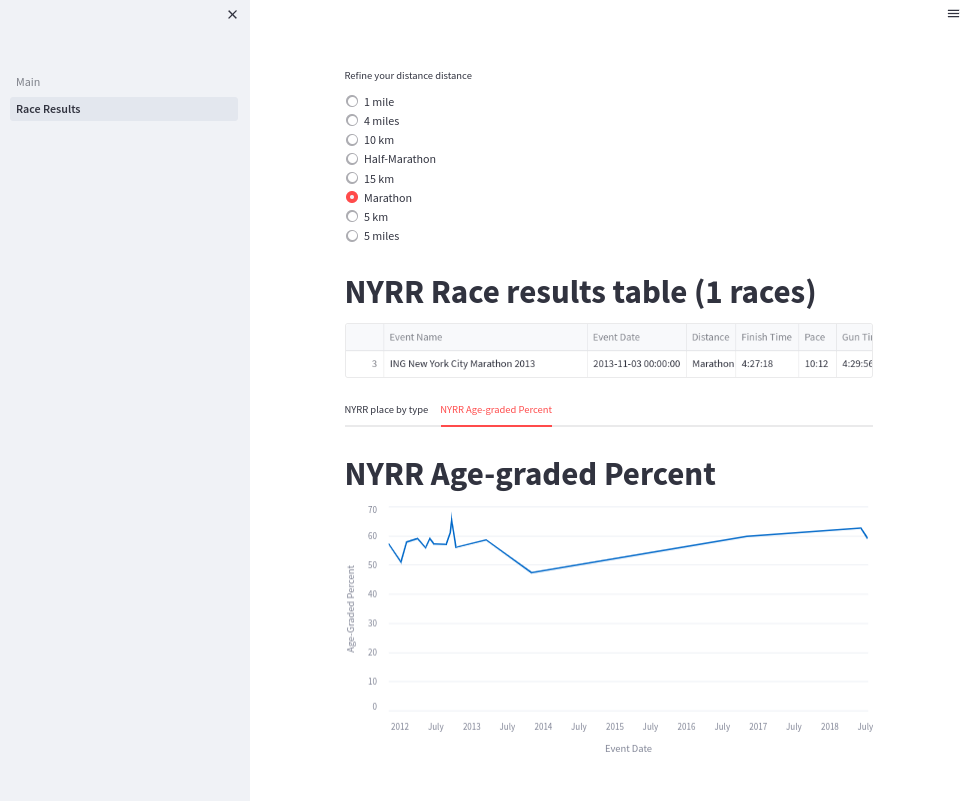
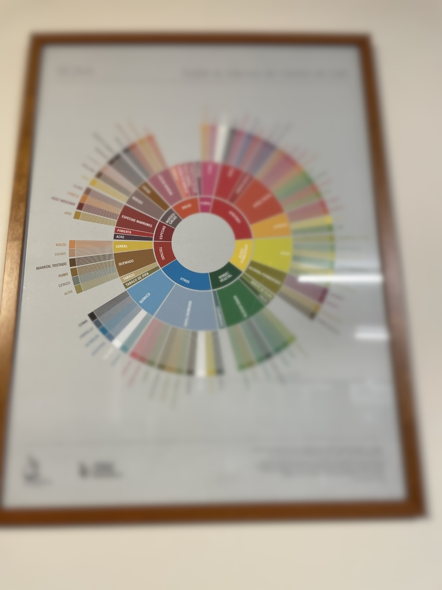
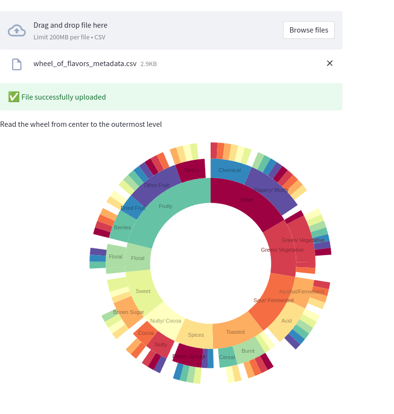

# Using Streamlit to display your data

[Streamlit](https://streamlit.io/) is an [Open Source](https://github.com/streamlit/streamlit) data visualization framework written in Python. It is aimed to data science, finance, machine learning and any other discipline that requires to display data that can be obtained programmatically.

What sets Streamlit apart from other frameworks is that is very easy to use and offers a very low entry barrier to people to write applications that require displaying application in sophisticated ways or needs to integrate with existing Python code.

This article will cover the following topics

* How to install Streamlit using PIP and a virtual environment
* How to run a basic application that displays the results of races ran with the NYRR.org club. In a previous article I explained how you can display the race results using Grafana running on a Podman container.
* And finally how to use third party libraries to show your data in creative ways.

I will not cover more advanced topics like value caching, as well other widgets. Also, I assume you have a basic understanding of the following:

* [Scripting in Python](https://www.redhat.com/sysadmin/python-scripting-intro)
* Writing applications that understand the rest protocol
* Using [Pandas](https://pandas.pydata.org/pandas-docs/stable/index.html) data structure [Dataframe](https://pandas.pydata.org/pandas-docs/stable/reference/frame.html) (will cover very basic usage)

Let's move now to the next step, which is to install the Streamlit.

## Installing on a virtual environment

Best way to run this on bare-metal is to install it inside a [virtual environment](https://www.redhat.com/sysadmin/packaging-applications-python):

```shell
python3 -m venv ~/virtualenv/Streamlit
. ~/virtualenv/Streamlit/bin/activate
python3 -m pip install --upgrade pip
pip3 install -r requirements.txt
```

Your application can have other dependencies besides Streamlit and just like a regular Python application you can manage those using pip.

## Life cycle of race results application

Before I dive into the code, let's look into a few concepts using a small program that shows my race results, on a CSV format.

* Streamlit relies heavily on 'session data' (st.session_state) to communicate changes between widgets. Every time you change a value on a widget and if the widget has a unique name, you can capture the updated status on other widgets.
* The flow of a Streamlit app is from top to bottom, and when something changes on the UI the page gets executed again, but it carries on changes in the session.
* A Streamlit application can be broken into pages, to make it easier to display information. To share data between pages, you use session state.

You should read the [session state documentation](https://docs.streamlit.io/library/api-reference/session-state), it will make it easier to write the proper workflow for your application.

Let's talk about the data. Streamlit can query a database, a binary file, and on this case a CSV file that looks like this:

```csv
Event Name,Event Date,Distance,Finish Time,Pace,Gun Time,Overall Place,Gender Place,Age-Group Place,Age-Graded Time,Age-Graded Place,Age-Graded Percent
2018 NYRR Virtual GOOAAALLL 5K,07/15/2018,5 km,0:24:06,07:46,0:24:06,516,469,59,0:22:02,375,58.97
2018 NYRR Virtual Global Running Day 1M,06/10/2018,1 mile,0:06:31,06:31,0:06:31,203,182,23,0:05:56,138,62.57
2016 Abbott Dash to the Finish Line 5K,11/05/2016,5 km,0:23:27,07:33,0:29:40,1055,819,94,0:21:44,723,59.76
ING New York City Marathon 2013,11/03/2013,Marathon,4:27:18,10:12,4:29:56,27160,19238,4046,4:19:57,21389,47.30
NYC Half 2013,03/17/2013,Half-Marathon,1:42:31,07:50,1:50:39,2322,1760,277,1:39:42,1989,58.56
Grete's Great Gallop in Support of AKTIV Foundation,10/14/2012,Half-Marathon,1:48:34,08:17,1:51:27,1508,1154,237,1:45:02,1267,56.00
NYRR Fifth Avenue Mile Presented by Nissan,09/22/2012,1 mile,0:05:59,05:59,9:59:48,1241,1116,204,0:05:42,1116,65.19
Fitness Games Men,09/15/2012,4 miles,0:29:07,07:17,0:29:55,480,480,97,0:27:43,535,61.00
Percy Sutton Harlem 5K Run,08/25/2012,5 km,0:23:50,07:41,0:25:10,975,771,130,0:22:42,803,57.00
Achilles Hope & Possibility,06/24/2012,5 miles,0:38:38,07:44,0:39:05,386,326,75,0:37:18,409,57.17
Celebrate Israel,06/03/2012,4 miles,0:30:04,07:31,0:31:52,856,748,143,0:28:38,829,59.00
UAE Healthy Kidney 10K,05/12/2012,10 km,0:49:15,07:56,0:51:29,1886,1567,308,0:47:49,1728,55.89
New York Colon Cancer Challenge 15K,04/01/2012,15 km,1:12:47,07:49,1:13:13,651,544,118,1:09:53,594,59.00
NYRR Gridiron Classic,02/05/2012,4 miles,0:30:28,07:37,0:33:45,1173,960,174,0:29:15,1099,57.80
Joe Kleinerman 10K,01/07/2012,10 km,0:55:05,08:52,0:59:35,2423,1708,316,0:52:51,1850,51.00
NYRR Dash to the Finish Line (5K),11/05/2011,5 km,0:23:36,07:36,0:25:32,593,471,90,0:22:40,562,57.28
```

Now let's see how we apply this to our basic application. First we define a python package called 'running' and on the default module we put 2 functions to help us load the data from the race results CSV file as well another to get the list of all the possible distances ever run.

We will also use [Pandas](https://pandas.pydata.org/), as it offers a great deal of flexibility for making queries and is supported out of the box by the graphic widgets.

```python
from io import StringIO
from pathlib import Path
from typing import List
import traceback
import sys

import streamlit as st
import pandas as pd
from pandas import DataFrame
from pandas.errors import EmptyDataError

DATE_COLUMN = 'Event Date'


def load_data(raw_data: [Path, StringIO], verbose: bool = False) -> DataFrame:
    data: DataFrame
    if isinstance(raw_data, StringIO) or isinstance(raw_data, Path):
        try:
            data = pd.read_csv(raw_data)
        except EmptyDataError:
            if verbose:
                traceback.print_exc()
                st.warning("Will return an empty DataFrame from load_data", file=sys.stderr)
            return DataFrame()
    else:
        raise ValueError(f"I don't now how to handle {raw_data}")
    data[DATE_COLUMN] = pd.to_datetime(data[DATE_COLUMN])
    return data


def get_distances(df: DataFrame) -> List:
    if 'Distance' in df:
        return [x for x in set(df.get(["Distance"]).to_dict(orient='list')['Distance'])]
    return []
```

Our application starts with a file called '[nyrr/Main.py](nyrr/Main.py)', which takes care of showing some basic messages on the GUI, and also allows the user to select a CSV file with the race results:

```python
import sys
from pathlib import Path
from io import StringIO
import streamlit as st

from nyrr.running import get_distances, load_data

if __name__ == "__main__":
    data_load_state = st.text('No data loaded yet...')
    raw_data = None
    if len(sys.argv) == 2:
        st.title(f'NYRR Race results, using {sys.argv[1]}')
        race_file = Path(sys.argv[1])
        if race_file.exists():
            with open(race_file, 'r') as race_data:
                raw_data = race_data.read()
        st.success('File successfully read', icon="✅")
    else:
        st.title(f'NYRR Race results, choose a file')
        uploaded_file = st.file_uploader(
            label="Choose the race results file",
            type=['csv'],
            accept_multiple_files=False,
            key="uploader"
        )
        if uploaded_file is not None:
            bytes_data = uploaded_file.getvalue()
            raw_data = StringIO(bytes_data.decode('utf-8'))
            data_load_state.text(f"Loaded race data")
            st.success('File successfully uploaded', icon="✅")
    if raw_data:
        dataframe = load_data(raw_data)
        distances = get_distances(dataframe)
        st.session_state['race data'] = dataframe
        st.session_state['all race distances'] = distances
        if 'distance chosen' in st.session_state:
            del st.session_state['distance chosen']
        data_load_state.text(f"Loaded race data was loaded ({len(dataframe)} races, {len(distances)} distances).")
```

I choose to show or hide some graphic elements depending on if is the first time the application is called. Also:
* I saved all the race results and the race distances on a session (st.session_state['key'] = 'value') as they will be used on other pages (pages directory).
* There are 4 GUI elements on this page, a Radio button to choose the distance data that will be displayed on the dataframe table, and two line chars showing the event date and the overall place on the race 

```python
import logging
import streamlit as st
from pandas import DataFrame


def has_basic_data() -> bool:
    """
    Check here if required session values exist. They are defined in Main page.
    :return:
    """
    return 'race data' in st.session_state and 'all race distances' in st.session_state


def filter_by_distance(race_data: DataFrame, distance: str, verbose: bool = False) -> DataFrame:
    """
    Query data from an existing Panda DataFrame and return a new filtered instance
    :param race_data:  Original dataframe
    :param distance: Distance to use as a filter
    :param verbose: Show extra messages on the console
    :return: Filtered dataframe
    """
    query = f"Distance == '{distance}'"
    if verbose:
        logging.info(f"Distance query: {query}")
    return race_data.query(inplace=False, expr=query)


if __name__ == "__main__":

    if not has_basic_data():
        st.title(f"NYRR Race results")
        st.write("Please go to the main page and load the race results you want to study")
    else:
        distance_chosen = st.radio(
            label="Refine your distance distance",
            options=st.session_state['all race distances'],
            index=0,
            key="distance chosen"
        )

        filtered_data_frame: DataFrame = filter_by_distance(
            race_data=st.session_state['race data'],
            distance=st.session_state['distance chosen'],
            verbose=True
        )
        st.title(f"NYRR Race results table ({len(filtered_data_frame)} races)")
        st.dataframe(
            data=filtered_data_frame,
            use_container_width=True
        )

        tab1, tab2 = st.tabs(["NYRR place by type", "NYRR Age-graded Percent"])
        with tab1:
            st.line_chart(
                st.session_state['race data'],
                x="Event Date",
                y=["Overall Place", "Gender Place", "Age-Group Place", "Age-Graded Place"]
            )
        with tab2:
            st.title(f"NYRR Age-graded Percent")
            st.line_chart(
                st.session_state['race data'],
                x="Event Date",
                y=["Age-Graded Percent"]
            )
```

Here you can see how the Racing Page looks like with the first tab selected:



It is entire possible than the user can click the 'Race Results' page, before loading any data!. So I check for the existence of required session state data and if is not present I refuse to show any GUI components.

If the data is present then allow the user to filter the original dataframe using the default distance. If the user clicks a different distance then the session is updated, page is re-run from top to bottom but this time a new filtered dataframe is created with a different race distance. 

### Running the race results application

```shell
(Streamlit) [josevnz@dmaf5 Streamlit]$ cd nyrr
(Streamlit) [josevnz@dmaf5 Streamlit]$ streamlit run Main.py --server.port=8501 --server.address=0.0.0.0

  You can now view your Streamlit app in your browser.

  URL: http://0.0.0.0:8501
```

Now you can point your browser to the server where you started the application, port 8501.

Probably you are wondering if there is a good way to package your application, so it can be installed anywhere? A container can do that for us, let me show you how

### Creating a containerized race results application using Podman

The container Dockerfile looks like this:

```dockerfile
FROM python:3.9-slim
WORKDIR /app
COPY . /app/
RUN /usr/local/bin/python -m pip install --upgrade pip && \
    /usr/local/bin/pip3 install -r requirements.txt
EXPOSE 8501
HEALTHCHECK CMD python3 -c 'from urllib import request; request.urlopen("http://localhost:8501/_stcore/health")'
ENTRYPOINT ["streamlit", "run", "Main.py", "--server.port=8501", "--server.address=0.0.0.0"]
```

You can create the image as follows:

```shell
```shell
cd nyrr && podman build --file Dockerfile --tag races-streamlite .
```

And then you can launch in the foreground like this:

```shell
podman run --tty --interactive --name races_result --rm --publish 8501:8501 races-streamlite
```

We saw so far how we can create a nice GUI with several graphics components, with very little code. A living document, a demo.

I was curious what else I could do with Streamlit. Shall we take a detour and have some coffe instead?

## Una tasa de Café, por favor (A cup of Coffee please)

**I love Coffe**. When I was a child living in Venezuela, I grew up drinking 'Café con Leche' (An equivalent of a Latte) for breakfast. As I grew older, my interest on other ways to prepare it also grew up and one day my wife decided to enroll us in a Coffee tasting course.

I learn there how little I knew about how Coffee is prepared and how difficult is to describe how a drink taste to others.

Our smell can differentiate many more things than we can taste and that's even bigger compared on how many flavors we can describe with words. To complicate things, when we talk about Coffee we could use a common language to describe the taste in a way that reduces ambiguity. 

The folks of [World Coffee Research](https://worldcoffeeresearch.org/) have been thinking about this and came up with a [Sensory Lexicon](https://worldcoffeeresearch.org/download/5806d8c7-cd7c-4882-a81a-2850bd6fbd36):

> World Coffee Research unites the global coffee industry to drive science-based agricultural solutions to urgently secure a 
> diverse and sustainable supply of quality coffee today and for generations to come.

Now, if you are like me, you are better with graphics than words. The _Speciality Coffee Association of America (SCAA)_ came up with a (Flavor Wheel)[http://www.scaa.org/?d=scaa-flavor-wheel&page=resources] that you could use to describe the flavor in your Coffee.

Below is a photo I took, so you can get an idea how flavors are arranged, you are encouraged [to buy the poster so part of the proceedings support World Coffee Research](https://sca.coffee/store-index/the-coffee-tasters-flavor-wheel-poster-english), which also helps farmers.



So, _how the wheel works?_ You start taking a sip of your favorite Joe and then start moving from the center of the wheel, outwards:

1. Say your Coffee tastes like Nuts/ Cocoa "Nueces/ Cacao"
2. Then you move one level out and choose between Nueces (Nuts) or Cacao (Cacao). For sake of argument, you decided is more Cacao than Nuts
3. You move out one last level. The end flavor is either Chocolate (Chocolate), Chocolate Amargo (Dark Chocolate)
4. You say at the end the drink tasted like Chocolate and everybody thinks you are genius!

That's it, 3 steps, and now you can communicate how your coffee tastes in common way.

Would be nice to have a small web app that I could use to describe this to anyone tasking coffee, let's get to it.

### Putting the app together

The wheel of flavors looks like a perfect match for a [Sunburst diagram](https://nivo.rocks/sunburst/), using the [streamlit-elements](https://github.com/okld/streamlit-elements) wrapper.

The logic is pretty simple, we load all the levels from a simple [flavor metadata](data/wheel_of_flavors_metadata.csv) CSV file:

```csv
"Basic","Middle","Final"
"Basic","Middle","Final"
"Other","Chemical","Rubber"
"Other","Chemical","Skukery"
"Other","Chemical","Petroleum"
"Other","Chemical","Medicinal"
"Other","Chemical","Salty"
"Other","Chemical","Bitter"
```

And then we concert the data into a hierarchy than can be understood by the third party [Nivo Sunburst](https://nivo.rocks/sunburst/) widget API:

```python
"""
This is a Streamlit application that shows how to make the Flavor wheel created
by [SAAC](https://sca.coffee/research/coffee-tasters-flavor-wheel?page=resources&d=scaa-flavor-wheel)
> Originally published in 1995, the Coffee Taster's Flavor Wheel—one of the most iconic resources in the coffee
> industry—has been the industry standard for over two decades. In 2016, this valuable resource was updated in
> collaboration with World Coffee Research (WCR).
Author: @josevnz@fosstodon.org
"""
from io import StringIO
from csv import DictReader
import streamlit as st
from streamlit_elements import mui, elements
from streamlit_elements import nivo

MARGIN = {'top': 1, 'right': 1, 'bottom': 1, 'left': 1}
COLORS = {'scheme': 'spectral'}
BORDER_COLOR = {'theme': 'background'}
ARC_LABELS_TEXT_COLOR = {
    'from': 'color',
    'modifiers': [
        ['darker', 1.4]
    ]
}
CHILD_COLOR = {
    'from': 'color',
    'modifiers': [
        ['brighter', 0.13]
    ]
}


def load_data(raw: StringIO) -> dict[str, any]:
    """
    Parse flat CSV metadata and convert it to format suitable for Graphic rendering
    :param raw:
    :return:
    """
    hierarchy = {}
    with raw:
        reader = DictReader(raw)
        for row in reader:
            basic = row["Basic"]
            middle = row["Middle"]
            final = row["Final"]
            if basic not in hierarchy:
                hierarchy[basic] = {}
            if middle not in hierarchy[basic]:
                hierarchy[basic][middle] = set([])
            hierarchy[basic][middle].add(final)
    flavor = {
        'name': 'flavors',
        'children': [],
    }
    for basic in hierarchy:
        basic_flavor = {
            'name': basic,
            'loc': 1,
            'children': []
        }
        for middle in hierarchy[basic]:
            middle_flavor = {
                'name': middle,
                'loc': 1,
                'children': []
            }
            for final in hierarchy[basic][middle]:
                if final:
                    final_flavor = {
                        'name': final,
                        'loc': 1,
                        'children': []
                    }
                    middle_flavor['children'].append(final_flavor)
            basic_flavor['children'].append(middle_flavor)
        flavor['children'].append(basic_flavor)
    return flavor


if __name__ == "__main__":

    st.title(f'Wheel of Coffee flavor, choose a file')

    """
    > Originally published in 1995, the Coffee Taster's Flavor Wheel—one of the most iconic resources in the coffee 
    > industry—has been the industry standard for over two decades. In 2016, this valuable resource was updated 
    > in collaboration with World Coffee Research (WCR). The foundation of this work, 
    > the [World Coffee Research Sensory Lexicon](http://worldcoffeeresearch.org/read-more/news/174-world-coffee-research-sensory-lexicon), is the product of dozens of professional 
    > sensory panelists, scientists, coffee buyers, and roasting companies collaborating via 
    > WCR and SCA. This is the largest and most collaborative piece of research on coffee 
    > flavor ever completed, inspiring a new set of vocabulary for industry professionals.
    """

    data_load_state = st.text('No data loaded yet...')
    uploaded_file = st.file_uploader(
        label="Choose the flavor wheel metadata file",
        type=['csv'],
        accept_multiple_files=False,
        key="uploader"
    )
    raw_data = None
    if uploaded_file is not None:
        bytes_data = uploaded_file.getvalue()
        raw_data = StringIO(bytes_data.decode('utf-8'))
        data_load_state.text(f"Loaded flavor data")
        st.success('File successfully uploaded', icon="✅")
    if raw_data:
        flavor_data = load_data(raw_data)
        """
        Read the wheel from center to the outermost level
        """
        with elements("nivo_charts"):
            with mui.Box(sx={"height": 900}):
                nivo.Sunburst(
                    data=flavor_data,
                    margin=MARGIN,
                    width=850,
                    height=500,
                    id="name",
                    value="loc",
                    cornerRadius=1,
                    borderColor=BORDER_COLOR,
                    colorBy="id",
                    colors=COLORS,
                    childColor=CHILD_COLOR,
                    inheritColorFromParent=False,
                    enableArcLabels=True,
                    arcLabel='id',
                    arcLabelsSkipAngle=7,
                    arcLabelsTextColor=ARC_LABELS_TEXT_COLOR
                )
```

Now you only need to hover you mouse to give a qualitative answer about how your coffe taste.



This is great, few lines of code, and now we can pack a lot of information on the screen without overwhelming the user. 

## Conclusion

I covered a few things here, but you can clearly see the potential of this framework for rapid prototyping because of 
its easy-to-use API and great compatibility with external graphic libraries.

Let's recap a few things:

* [Please check the documentation](https://docs.streamlit.io/) it is well written and clear. Spend some time getting familiar with what the framework can do.
* Support of Markdown is excellent, which means you can write beautiful interactive tutorials/ data science presentations for your users in short time while tapping real production data.
* There is much more you can do, applications can be polished to be more interactive and the ability of this framework to interact with external graphic libraries makes it very attractive to create good-looking applications with very little code.
* You also learned how to package your fresh from the oven Streamlit with a [Podman](https://podman.io/) container, so it can be run anywhere with the latest version of Python.

In a follow-up article I will show you how you can use Streamlit to monitor your infrastructure, by talking to datasources like Prometheus.
