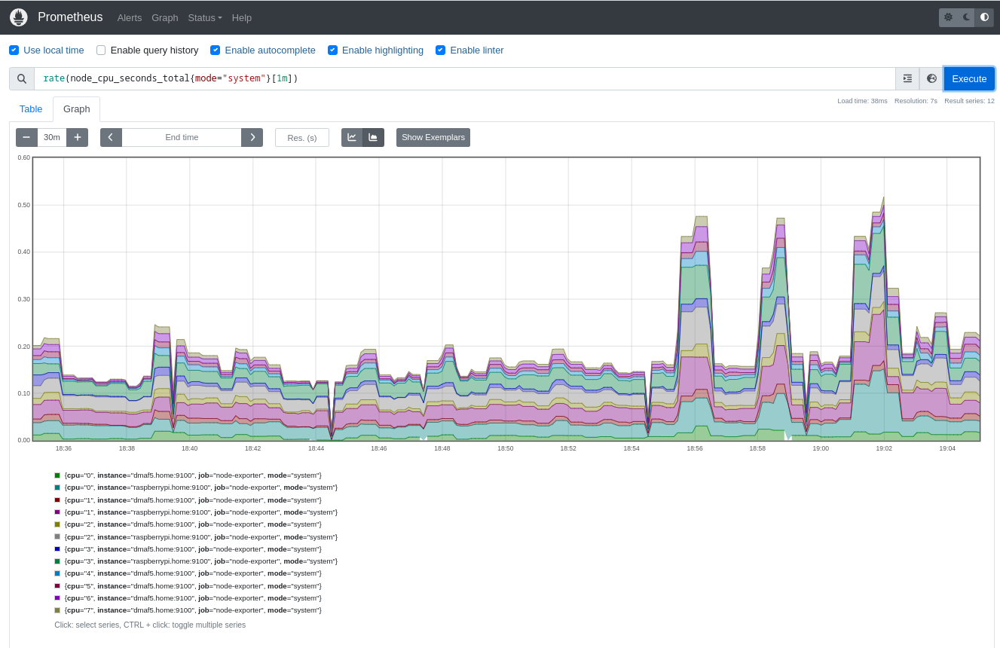
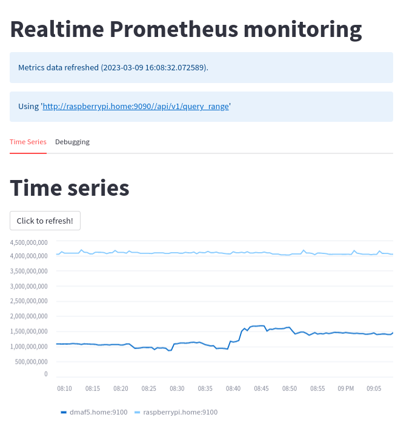
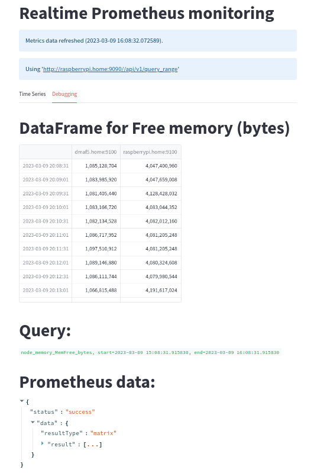

# Using Streamlit to display your data

[Streamlit](https://streamlit.io/) is an [Open Source](https://github.com/streamlit/streamlit) data visualization framework written in Python. It is aimed to data science, finance, machine learning and any other discipline that requires to display data that can be obtained programmatically.

What sets Streamlit apart from other frameworks is that is very easy to use and offers a very low entry barrier to people to write applications that require displaying application in sophisticated ways or needs to integrate with existing Python code.

This article will cover the following topics, if you need a gentle introduction you can check my [previous piece about Streamlit](INTRODUCTION.md).

* How to quickly set up a Prometheus node exporter and a scrapper to collect metrics about your system, using an Ansible playbook.
* How to connect to the Prometheus scrapper to get metrics and display them in real time

## Monitor memory utilization periodically from my hosts machines

[Prometheus](https://prometheus.io/) is an Open Source framework that was created to collect metrics about your system. It also provides visualization, efficient storage and many other cool features.

A typical on-premise Prometheus setup is to have one or more node-exporter collectors and then to have the main scrapper aggregating the data from all those nodes.

Eventually you can visualize the collected data directly on your http://prometheuscollector:9090/ agent or have another visualization tool like Grafana talking to the collector.

Let's take a look at some pieces first before trying to setup a Streamlit application that can talk to Prometheus.

### The Prometheus collector (scrapper)

Say my home lab has 2 machines, called raspberrypi and dmaf5, both running node-exporter agents. I can set up my Prometheus scrapper configuration (prometheus.yaml) to reflect that:

```yaml
---
global:
    scrape_interval: 30s
    evaluation_interval: 30s
    scrape_timeout: 10s
    external_labels:
        monitor: 'nunez-family-lab-monitor'

scrape_configs:
    - job_name: 'node-exporter'
      static_configs:
          - targets: ['raspberrypi.home:9100', 'dmaf5.home:9100']
```

How do we install all the data acquisition pieces?  Let's use an Ansible playbook for that

## Automating the boring stuff with Ansible

For our automation recipe to work the following pieces are put together:

1. [Inventory file](prometheus/inventory/home_lab_inventory.yaml): Will tell Ansible where to install and deploy our node-exporter agents
2. Template to setup the [Prometheus daemon](prometheus/templates/prometheus.yaml.j2) that will collect our metrics.
3. Systemd unit file for [Prometheus](prometheus/templates/prometheus.service.j2) and [Node-Exporter](prometheus/templates/node_exporter.service.j2).  Node-exporter runs on each node and Prometheus on the master node.
4. The [playbook](prometheus/provision_prometheus.yaml) that will orchestrate all the actions, from copying configurations, downloading software and finally starting processes: 

```yaml
# Playbook to provision Prometheus scrapper and node-exporter servers
# Download binaries from: https://prometheus.io/download/#prometheus
# Checked with: ansible-lint provision_prometheus.yaml
---
- name: Setup Prometheus on your home lab
  hosts: home_lab
  become_user: root
  become: true
  vars:
    prometheus_scrapper_version: "2.42.0"
    prometheus_node_exporter_version: "1.5.0"
    prometheus_url: "https://github.com/prometheus/prometheus/releases/download"
    exporter_url: "https://github.com/prometheus/node_exporter/releases/download"
    prometheus_node_exporter_port: 9100
    prometheus_install_dir: "/opt/prometheus"
    prometheus_data_dir: "/data/prometheus"
    prometheus_conf_dir: "/etc/prometheus"
  tasks:
    - name: Set architecture (home lab has amd64 and arm64)
      set_fact:
        prom_arch: "{{ 'amd64' if ansible_architecture == 'x86_64' else 'arm64' }}"
    - name: Prometheus user
      tags: user
      ansible.builtin.user:
        name: prometheus
        system: true
        create_home: false
        comment: "Prometheus service account"
        shell: /sbin/nologin
        state: present
    - name: Prometheus install directory
      ansible.builtin.file:
        state: directory
        owner: "prometheus"
        path: "{{ prometheus_install_dir }}"
    - name: Scrapper management
      when: "'master_lab' in group_names"
      block:
        - name: Install Prometheus Scrapper
          tags: scrapper
          ansible.builtin.get_url:
            dest: "/tmp/prometheus-{{ prometheus_scrapper_version }}.linux-{{ prom_arch }}.tar.gz"
            url: "{{ prometheus_url }}/v{{ prometheus_scrapper_version }}/prometheus-{{ prometheus_scrapper_version }}.linux-{{ prom_arch }}.tar.gz"
            checksum: "sha256:b947e4890d221f6b1d09c963fd0440720f2b5d08c29e190d6365f4b3d3e92a9d"
            mode: "u=rw"
        - name: Unpack Prometheus Scrapper
          tags: unpack_scrapper
          ansible.builtin.unarchive:
            remote_src: true
            owner: "prometheus"
            group: "prometheus"
            src: "/tmp/prometheus-{{ prometheus_scrapper_version }}.linux-{{ prom_arch }}.tar.gz"
            dest: "{{ prometheus_install_dir }}"
          notify:
            - Restart Prometheus
        - name: Prometheus config directory
          ansible.builtin.file:
            state: directory
            owner: "root"
            path: "{{ item }}"
          loop:
              - "{{ prometheus_conf_dir }}"
              - "{{ prometheus_data_dir }}"
        - name: Install Prometheus configuration
          tags: config_prometheus_copy
          ansible.builtin.template:
            src: templates/prometheus.yaml.j2
            dest: /etc/prometheus/prometheus.yaml
            owner: root
            group: root
          notify:
            - Restart Prometheus
        - name: Install Prometheus systemd unit
          tags: systemd_prometheus_copy
          ansible.builtin.template:
            src: templates/prometheus.service.j2
            dest: /etc/systemd/system/prometheus.service
            owner: root
            group: root
          notify:
            - Restart Prometheus
        - name: Make sure Prometheus is running
          tags: systemd_prometheus_start
          ansible.builtin.systemd:
            state: started
            name: prometheus
            enabled: true
            daemon_reload: true
    - name: Install Prometheus Node exporter
      tags: exporter
      ansible.builtin.get_url:
        dest: "/tmp/node_exporter-{{ prometheus_node_exporter_version }}.linux-{{ prom_arch }}.tar.gz"
        url: "{{ exporter_url }}/v{{ prometheus_node_exporter_version }}/node_exporter-{{ prometheus_node_exporter_version }}.linux-{{ prom_arch }}.tar.gz"
        checksum: "sha256:{{ 'af999fd31ab54ed3a34b9f0b10c28e9acee9ef5ac5a5d5edfdde85437db7acbb' if ansible_architecture == 'x86_64' else 'e031a539af9a619c06774788b54c23fccc2a852d41437315725a086ccdb0ed16' }}"
        mode: "u=rw"
    - name: Unpack Node exporter
      tags: unpack_exporter
      ansible.builtin.unarchive:
        remote_src: true
        owner: "prometheus"
        group: "prometheus"
        src: "/tmp/node_exporter-{{ prometheus_node_exporter_version }}.linux-{{ prom_arch }}.tar.gz"
        dest: "{{ prometheus_install_dir }}"
      notify:
        - Restart Node Exporter
    - name: Install Node Exporter systemd unit
      tags: systemd_node_exporter_copy
      ansible.builtin.template:
        src: templates/node_exporter.service.j2
        dest: /etc/systemd/system/node_exporter.service
        owner: root
        group: root
      notify:
        - Restart Node Exporter
    - name: Install Node Exporter environment overrides
      tags: systemd_node_exporter_env
      ansible.builtin.copy:
        src: files/prometheus-node-exporter
        dest: /etc/default/prometheus-node-exporter
        owner: root
        group: root
      notify:
        - Restart Node Exporter
    - name: Make sure Node Exporter is running
      tags: systemd_node_exporter_start
      ansible.builtin.systemd:
        state: started
        name: node_exporter
        enabled: true
        daemon_reload: true
  handlers:
    - name: Restart Node Exporter
      tags: restart_node_exporter
      ansible.builtin.service:
        name: node_exporter
        state: restarted
    - name: Restart Prometheus
      tags: restart_prometheus
      ansible.builtin.service:
        name: prometheus
        state: restarted

```

And see it in action (```ansible-playbook --inventory inventory provision_prometheus.yaml```):

[](https://asciinema.org/a/564742)

After running the playbook you can check if it is collecting data by going to the Prometheus host you set up in your inventory, then you can run queries using PromQL like this one:

```sql
rate(node_cpu_seconds_total{mode="system"}[1m])
```



## Showing Prometheus metrics with Streamlit

Prometheus supports queries using the [PromQL language](https://prometheus.io/docs/prometheus/latest/querying/basics/).  It also offerts a [REST API](https://prometheus.io/docs/prometheus/latest/querying/api/) to run remote queries.

To demonstrate how the monitoring works, will use the following metric:

```sql
node_memory_MemFree_bytes
```
It returns a JSON response (you can see a [full example](monitoring/prometheus_query_range_example.json) here):

```json
{
 "status": "success",
 "data": {
  "resultType": "matrix",
  "result": [
   {
    "metric": {
     "__name__": "node_memory_MemFree_bytes",
     "instance": "dmaf5.home:9100",
     "job": "node-exporter"
    },
    "values": [
     [
      1678066203.119,
      "1086185472"
     ],
     [
      1678066233.119,
      "1086185472"
     ],
     [
      1678066263.119,
      "1086185472"
     ]
    ]
   }
  ]
 }
}
```
The code for this monolithic application is quite simple:

```python
import json
import logging
from datetime import datetime, timedelta
from json.decoder import JSONDecodeError
import os
import textwrap
import altair
import requests
import streamlit as st
from pandas import DataFrame, Series, Timestamp
from numpy import float64
from requests import HTTPError, RequestException

MINUTES_BACK = 60
DEFAULT_TIME_BACK = timedelta(minutes=-MINUTES_BACK)
DEFAULT_QUERY = 'node_memory_MemFree_bytes'
STEP_DURATION = "30s"


@st.cache_data
def full_url(url: str, has_time_range: bool = True) -> str:
    if has_time_range:
        return f"{url}/api/v1/query_range"  # Range query
    return f"{url}/api/v1/query"  # Instant query


def get_metrics(
        the_payload: dict[str, any],
        url: str,
        start_range: datetime = None,
        end_range: datetime = None
) -> (dict[any, any], int):
    new_query = {}
    new_query.update(the_payload)
    if start_range and end_range:
        new_query['start'] = start_range.timestamp()
        new_query['end'] = end_range.timestamp()
        new_query['step'] = STEP_DURATION
    logging.info("url=%s, params=%s", url, new_query)
    response = requests.get(url=url, params=new_query)
    return response.json(), response.status_code


def transform(m_data: dict[any, any]) -> DataFrame:
    """
    Convert a Prometheus data structure into a Panda DataFrame
    :param m_data:
    :return: DataFrame
    """
    df = DataFrame({
        mtr['metric']['instance']: Series(
            data=[float64(vl[1]) for vl in mtr['values']],
            index=[Timestamp(vl[0], unit='s') for vl in mtr['values']],
            name="Free memory (bytes)"
        ) for mtr in m_data['data']['result']
    })
    logging.info(f"Columns: {df.columns}")
    logging.info(f"Index: {df.index}")
    logging.info(f"Index: {df}")
    return df


if __name__ == "__main__":

    st.title("Realtime Prometheus monitoring")
    data_load_state = st.text('No data loaded yet...')
    if 'PROMETHEUS_URL' not in os.environ:
        st.markdown("## Please define the following environment variable and restart this application (example below):")
        st.code(textwrap.dedent(f"""
        PROMETHEUS_URL="http://raspberrypi:9090/"
        export PROMETHEUS_URL
        streamlit run {__file__}
        """))
        st.markdown(
            "New to Prometheus?. Please check the [Official](https://prometheus.io/docs/prometheus/latest/querying/api/) documentation")
        data_load_state.error("No data was loaded.")
    else:
        code = 0
        metrics = {}
        try:
            PROM_URL = full_url(os.environ['PROMETHEUS_URL'], has_time_range=True)
            st.info(f"Using '{PROM_URL}'")
            query = DEFAULT_QUERY
            payload = {'query': query}
            # First query we boostrap with a reasonable time range
            END: datetime = datetime.now()
            START = END + DEFAULT_TIME_BACK
            if payload:
                (graph, raw) = st.tabs(["Time Series", "Debugging"])
                metrics, code = get_metrics(
                    url=PROM_URL,
                    the_payload=payload,
                    start_range=START,
                    end_range=END,
                )
                data: DataFrame = DataFrame()
                if code == 200:
                    now = datetime.now()
                    data_load_state.info(f"Metrics data refreshed ({now}).")
                    logging.info(f"Metrics data refreshed ({now}).")
                    try:
                        data = transform(m_data=metrics)
                        with graph:
                            st.title("Time series")
                            # See auto-refresh dilema: https://github.com/streamlit/streamlit/issues/168
                            if st.button('Click to refresh!'):
                                st.write("Refreshing")
                                st.experimental_rerun()
                            # st.line_chart(data=data)
                            # You can see all the possible type encodings here: 
                            # https://altair-viz.github.io/altair-tutorial/notebooks/02-Simple-Charts.html
                            chart = (
                                altair.Chart(data.stack().rename("value").reset_index()).mark_line().encode(
                                    x="level_0:T",
                                    y="value:Q",
                                    color="level_1"
                                )
                            )
                            st.altair_chart(chart, use_container_width=True)                            

                    except ValueError as val:
                        st.exception(val)
                    with raw:
                        if not data.empty:
                            st.title("DataFrame for Free memory (bytes)")
                            st.dataframe(data)
                        st.title("Query:")
                        st.markdown(f"```{query}, start={START}, end={END}```")
                        st.title("Prometheus data:")
                        st.json(metrics)
                else:
                    st.warning(f"Hmm, invalid query?: {query}")
                    st.warning(json.dumps(metrics, indent=True))
        except (HTTPError, JSONDecodeError, RequestException, KeyError) as exp:
            st.error(f"There was a problem while running the query (HTTP_CODE={code})...")
            if isinstance(exp, KeyError):
                st.code(f"Metrics={json.dumps(metrics, indent=True)}...")
            st.exception(exp)
```

A few notes here:
* My datasource is a Prometheus scrapper that returns a JSON document. I convert it to a Panda DataFrame, which is one of the most well-supported formats on Streamlit.
* After that I just add the graphical components, one tab to show my times series data and the other one to show the data and queries in tabular format, for debugging purposes.
* I added a button to manually refresh the plot data, but there are ways to auto-refresh the contents.

How does it look like? Below is a screenshot of the Prometheus times series line chart:



And the debugging tab:



Now let's talk about how this framework compares against other tools out there and if is a good fit for a DevOps/ Systems administrator

## Comparison of Streamlit with other visualization tools

A brief comparison on what Grafana, InfluxDB and Streamlit can do out of the box can help you to decide which one to use. As usual, no single tool can do everything and most likely you will mix the 3 of them.

My focus is on observability in general for this analysis, some features may be more or less appealing to you (for example if your focus is on data science)

| Name      | Version | Tables | Time series graphics | Open Source | Embedded alerting                         | Multiple datasources | Supported language                                        | Automatic data refresh | Easy to write a 'live' paper?                                |
|-----------|---------|--------|----------------------|-------------|-------------------------------------------|----------------------|-----------------------------------------------------------|------------------------|--------------------------------------------------------------|
| Grafana   | 9.4     | Yes    | Yes                  | Yes         | Yes, multiple destinations supported      | Yes                  | GoLang, depends on the used datasource (JSONPath, FluxQL) | Yes                    | Supports markdown but requires write permission on Dashboard |
| InfluxDB  | 2.6.1   | Yes    | Yes                  | Yes         | Yes                                       | No                   | Flux, InFluxQL                                            | Yes                    | Supports markdown but requires write permission on Dashboard |
| Streamlit | 1.20.0  | Yes    | Yes                  | Yes         | No, requires external libraries and logic | Yes                  | Python                                                    | No, DIY                | Full freedom with Markdown, videos, intermixed.              |

It is interesting because these 3 products overlap in many areas but there are *key differences*:

1. They all can run in containers, which may simplify their deployment
2. Grafana is the most feature rich of them and needs to interface with an external data source like Prometheus, InfluxDB or a JSON REST service to visualize data. It is not a database and has powerful alerting mechanism (Email, Microsoft Teams, etc.)
3. InfluxDB is a time series database that also has dashboards and alerting capabilities, tough more limited than Grafana
4. Streamlit is a framework for data science applications, written in Python. It can interface with infinite datasources. Also is the easiest to setup of the three, but it is not a database and has no alerting capabilities.

So which one you should use? _It depends_. If you need quick prototyping and no alerting Streamlit is a good fit, if you only need a database with simple visualization and alerting then InfluxDB is for you and for a more complete solution (also more complex to setup) you cannot go wrong with Grafana.

## Conclusion

Streamlit is very well tuned for data science application, but you can also use it for Infrastructure monitoring. Also, you can create 'live reports' to quickly check the health of your sites, with very little coding.

* Grafana or InfluxDB may be better suited for infrastructure monitoring, but it doesn't mean Streamlit cannot tap [the same datasources](https://github.com/dcoles/prometheus-pandas). Running on top of Python makes it possible.
* Programmatic page refresh is [marked as experimental](https://docs.streamlit.io/library/api-reference/control-flow/st.experimental_rerun),  [you can see the original discussion of the feature here](https://github.com/streamlit/streamlit/issues/168).
* Finally, you can see another take on the [Prometheus](https://prometheus.io/docs/prometheus/latest/querying/api/#expression-query-result-formats) + Pandas combo on this [nice article](https://ricardorocha.io/blog/prometheus-metrics-in-pandas/).
