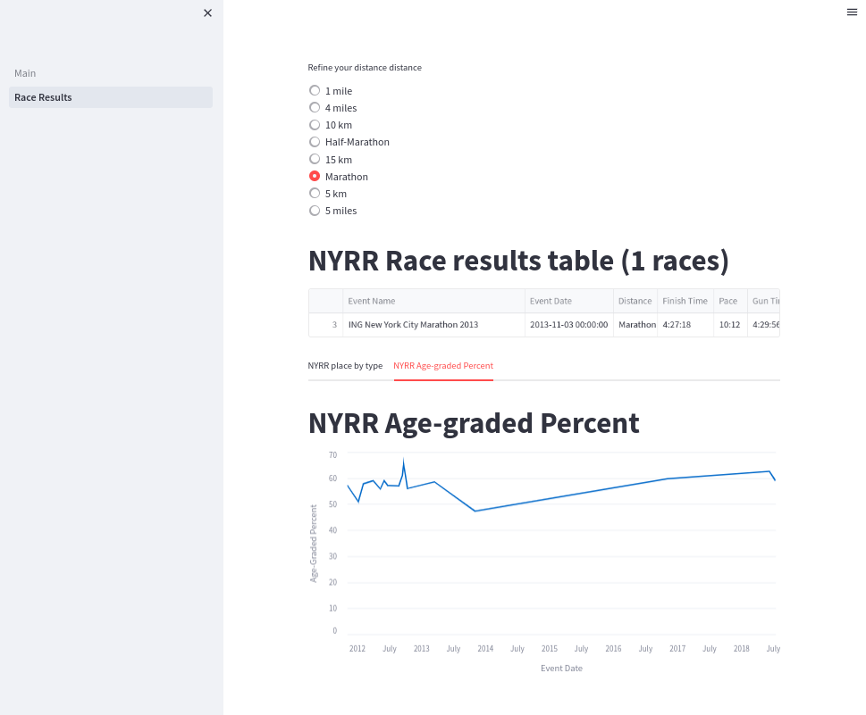
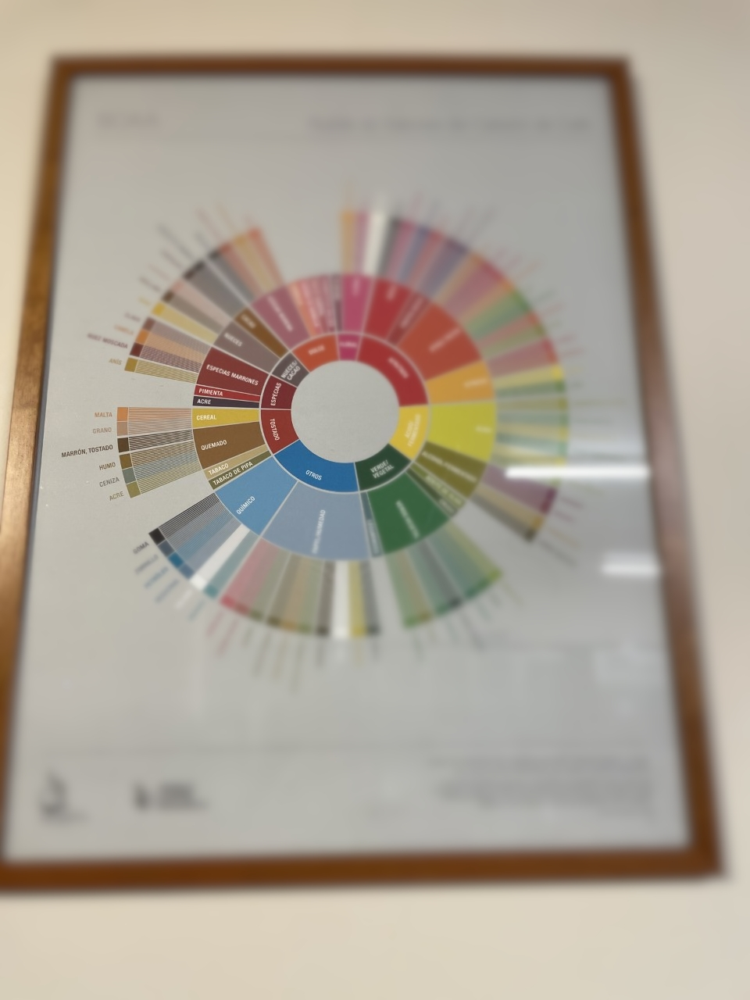
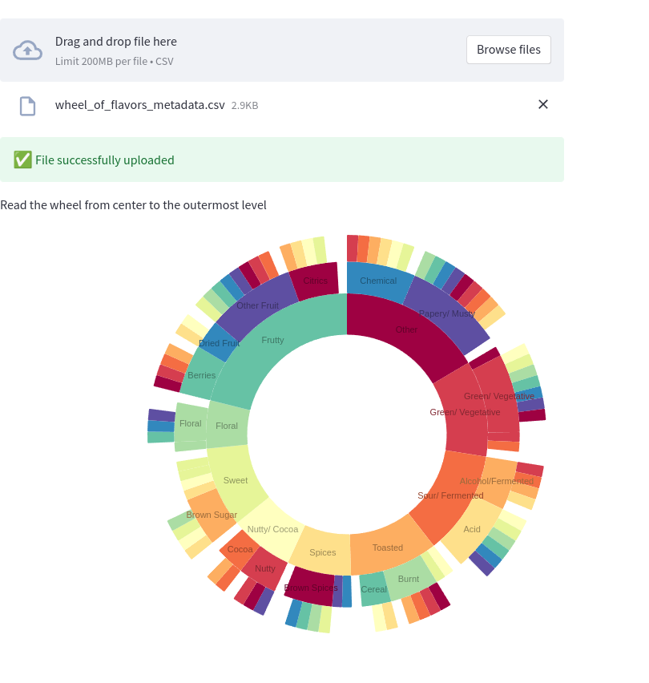

# Using Streamlit to display your data

[Streamlit](https://streamlit.io/) is an [Open Source](https://github.com/streamlit/streamlit) data visualization framework written in Python. It is aimed to data science, finance, machine learning and any other discipline that requires to display data that can be obtained programmatically.

What sets Streamlit apart from other frameworks is that is very easy to use and offers a very low entry barrier to people to write applications that require displaying application in sophisticated ways or needs to integrate with existing Python code.

This article will cover the following topics

* How to install Streamlit using PIP and a virtual environment
* How to run a basic application that displays the results of races ran with the NYRR.org club. In a previous article I explained how you can display the race results using Grafana running on a Podman container.
* Why to use Streamlit as opposed to other data display solutions (I will compare Streamlit with Grafana).

I will not cover more advanced topics like value caching, as well other widgets. Also, I assume you have a basic understanding of the following:

* [Scripting in Python](https://www.redhat.com/sysadmin/python-scripting-intro)
* Writing applications that understand the rest protocol
* Using [Pandas](https://pandas.pydata.org/pandas-docs/stable/index.html) data structure [Dataframe](https://pandas.pydata.org/pandas-docs/stable/reference/frame.html) (will cover very basic usage)

Let's move now to the next step, which is to install the Streamlit.

## Installing on a virtual environment

Best way to run this on bare-metal is to install it inside a [virtual environment](https://www.redhat.com/sysadmin/packaging-applications-python):

```shell
python3 -m venv ~/virtualenv/Streamlit
. ~/virtualenv/Streamlit/bin/activate
python3 -m pip install --upgrade pip
pip3 install -r requirements.txt
```

Your application can have other dependencies besides Streamlit and just like a regular Python application you can manage those using pip.

## Important concepts

Before I dive into the code, let's look into a few concepts

* Streamlit relies heavily on 'session data' (st.session_state) to communicate changes between widgets. Every time you change a value on a widget and if the widget has a unique name, you can capture the updated status on other widgets.
* The flow of a Streamlit app is from top to bottom, and when something changes on the UI the page gets executed again, but it carries on changes in the session.
* A Streamlit application can be broken into pages, to make it easier to display information. To share data between pages, you use session state.

*I strongly recommend* you read the [session state documentation](https://docs.streamlit.io/library/api-reference/session-state), it will make it easier to write the proper workflow for your application.

The raw race results look like this:

```csv
Event Name,Event Date,Distance,Finish Time,Pace,Gun Time,Overall Place,Gender Place,Age-Group Place,Age-Graded Time,Age-Graded Place,Age-Graded Percent
2018 NYRR Virtual GOOAAALLL 5K,07/15/2018,5 km,0:24:06,07:46,0:24:06,516,469,59,0:22:02,375,58.97
2018 NYRR Virtual Global Running Day 1M,06/10/2018,1 mile,0:06:31,06:31,0:06:31,203,182,23,0:05:56,138,62.57
2016 Abbott Dash to the Finish Line 5K,11/05/2016,5 km,0:23:27,07:33,0:29:40,1055,819,94,0:21:44,723,59.76
ING New York City Marathon 2013,11/03/2013,Marathon,4:27:18,10:12,4:29:56,27160,19238,4046,4:19:57,21389,47.30
NYC Half 2013,03/17/2013,Half-Marathon,1:42:31,07:50,1:50:39,2322,1760,277,1:39:42,1989,58.56
Grete's Great Gallop in Support of AKTIV Foundation,10/14/2012,Half-Marathon,1:48:34,08:17,1:51:27,1508,1154,237,1:45:02,1267,56.00
NYRR Fifth Avenue Mile Presented by Nissan,09/22/2012,1 mile,0:05:59,05:59,9:59:48,1241,1116,204,0:05:42,1116,65.19
Fitness Games Men,09/15/2012,4 miles,0:29:07,07:17,0:29:55,480,480,97,0:27:43,535,61.00
Percy Sutton Harlem 5K Run,08/25/2012,5 km,0:23:50,07:41,0:25:10,975,771,130,0:22:42,803,57.00
Achilles Hope & Possibility,06/24/2012,5 miles,0:38:38,07:44,0:39:05,386,326,75,0:37:18,409,57.17
Celebrate Israel,06/03/2012,4 miles,0:30:04,07:31,0:31:52,856,748,143,0:28:38,829,59.00
UAE Healthy Kidney 10K,05/12/2012,10 km,0:49:15,07:56,0:51:29,1886,1567,308,0:47:49,1728,55.89
New York Colon Cancer Challenge 15K,04/01/2012,15 km,1:12:47,07:49,1:13:13,651,544,118,1:09:53,594,59.00
NYRR Gridiron Classic,02/05/2012,4 miles,0:30:28,07:37,0:33:45,1173,960,174,0:29:15,1099,57.80
Joe Kleinerman 10K,01/07/2012,10 km,0:55:05,08:52,0:59:35,2423,1708,316,0:52:51,1850,51.00
NYRR Dash to the Finish Line (5K),11/05/2011,5 km,0:23:36,07:36,0:25:32,593,471,90,0:22:40,562,57.28
```

Now let's see how we apply this to our basic application. First we define a python package called 'running' and on the default module we put 2 functions to help us load the data from the race results CSV file as well another to get the list of all the possible distances ever run:

```python
from io import StringIO
from pathlib import Path
from typing import List
import traceback
import sys

import streamlit as st
import pandas as pd
from pandas import DataFrame
from pandas.errors import EmptyDataError

DATE_COLUMN = 'Event Date'


def load_data(raw_data: [Path, StringIO], verbose: bool = False) -> DataFrame:
    data: DataFrame
    if isinstance(raw_data, StringIO) or isinstance(raw_data, Path):
        try:
            data = pd.read_csv(raw_data)
        except EmptyDataError:
            if verbose:
                traceback.print_exc()
                st.warning("Will return an empty DataFrame from load_data", file=sys.stderr)
            return DataFrame()
    else:
        raise ValueError(f"I don't now how to handle {raw_data}")
    data[DATE_COLUMN] = pd.to_datetime(data[DATE_COLUMN])
    return data


def get_distances(df: DataFrame) -> List:
    if 'Distance' in df:
        return [x for x in set(df.get(["Distance"]).to_dict(orient='list')['Distance'])]
    return []
```

Our application starts with a file called '[Main.py](nyrr/Main.py)', which takes care of showing some basic messages on the GUI, and also allows the user to select a CSV file with the race results:

```python
import sys
from pathlib import Path
from io import StringIO
import streamlit as st

from nyrr.running import get_distances, load_data

if __name__ == "__main__":
    data_load_state = st.text('No data loaded yet...')
    raw_data = None
    if len(sys.argv) == 2:
        st.title(f'NYRR Race results, using {sys.argv[1]}')
        race_file = Path(sys.argv[1])
        if race_file.exists():
            with open(race_file, 'r') as race_data:
                raw_data = race_data.read()
        st.success('File successfully read', icon="✅")
    else:
        st.title(f'NYRR Race results, choose a file')
        uploaded_file = st.file_uploader(
            label="Choose the race results file",
            type=['csv'],
            accept_multiple_files=False,
            key="uploader"
        )
        if uploaded_file is not None:
            bytes_data = uploaded_file.getvalue()
            raw_data = StringIO(bytes_data.decode('utf-8'))
            data_load_state.text(f"Loaded race data")
            st.success('File successfully uploaded', icon="✅")
    if raw_data:
        dataframe = load_data(raw_data)
        distances = get_distances(dataframe)
        st.session_state['race data'] = dataframe
        st.session_state['all race distances'] = distances
        if 'distance chosen' in st.session_state:
            del st.session_state['distance chosen']
        data_load_state.text(f"Loaded race data was loaded ({len(dataframe)} races, {len(distances)} distances).")
```

I choose to show or hide some graphic elements depending on if is the first time the application is called. Also:
* I saved all the race results and the race distances on a session (st.session_state['key'] = 'value') as they will be used on other pages (pages directory).
* There are 4 GUI elements on this page, a Radio button to choose the distance data that will be displayed on the dataframe table, and two line chars showing the event date and the overall place on the race 

```python
import logging
import streamlit as st
from pandas import DataFrame


def has_basic_data() -> bool:
    """
    Check here if required session values exist. They are defined in Main page.
    :return:
    """
    return 'race data' in st.session_state and 'all race distances' in st.session_state


def filter_by_distance(race_data: DataFrame, distance: str, verbose: bool = False) -> DataFrame:
    """
    Query data from an existing Panda DataFrame and return a new filtered instance
    :param race_data:  Original dataframe
    :param distance: Distance to use as a filter
    :param verbose: Show extra messages on the console
    :return: Filtered dataframe
    """
    query = f"Distance == '{distance}'"
    if verbose:
        logging.info(f"Distance query: {query}")
    return race_data.query(inplace=False, expr=query)


if __name__ == "__main__":

    if not has_basic_data():
        st.title(f"NYRR Race results")
        st.write("Please go to the main page and load the race results you want to study")
    else:
        distance_chosen = st.radio(
            label="Refine your distance distance",
            options=st.session_state['all race distances'],
            index=0,
            key="distance chosen"
        )

        filtered_data_frame: DataFrame = filter_by_distance(
            race_data=st.session_state['race data'],
            distance=st.session_state['distance chosen'],
            verbose=True
        )
        st.title(f"NYRR Race results table ({len(filtered_data_frame)} races)")
        st.dataframe(
            data=filtered_data_frame,
            use_container_width=True
        )

        tab1, tab2 = st.tabs(["NYRR place by type", "NYRR Age-graded Percent"])
        with tab1:
            st.line_chart(
                st.session_state['race data'],
                x="Event Date",
                y=["Overall Place", "Gender Place", "Age-Group Place", "Age-Graded Place"]
            )
        with tab2:
            st.title(f"NYRR Age-graded Percent")
            st.line_chart(
                st.session_state['race data'],
                x="Event Date",
                y=["Age-Graded Percent"]
            )
```

Here you can see how the Racing Page looks like with the first tab selected:



It is entire possible than the user can click the 'Race Results' page, before loading any data!. So I check for the existence of required session state data and if is not present I refuse to show any GUI components.

If the data is present then allow the user to filter the original dataframe using the default distance. If the user clicks a different distance then the session is updated, page is re-run from top to bottom but this time a new filtered dataframe is created with a different race distance. 

## Running the application

```shell
(Streamlit) [josevnz@dmaf5 Streamlit]$ cd nyrr
(Streamlit) [josevnz@dmaf5 Streamlit]$ streamlit run Main.py --server.port=8501 --server.address=0.0.0.0

  You can now view your Streamlit app in your browser.

  URL: http://0.0.0.0:8501
```

Now you can point your browser to the server where you started the application, port 8501.

## Creating a containerized application using Podman

The container Dockerfile looks like this:

```dockerfile
FROM python:3.9-slim
WORKDIR /app
COPY . /app/
RUN /usr/local/bin/python -m pip install --upgrade pip && \
    /usr/local/bin/pip3 install -r requirements.txt
EXPOSE 8501
HEALTHCHECK CMD python3 -c 'from urllib import request; request.urlopen("http://localhost:8501/_stcore/health")'
ENTRYPOINT ["streamlit", "run", "Main.py", "--server.port=8501", "--server.address=0.0.0.0"]
```

You can create the container as follows:

```shell
```shell
cd nyrr && podman build --file Dockerfile --tag races-streamlite .
```

And then we can launch in the foreground like this:

```shell
podman run --tty --interactive --name races_result --rm --publish 8501:8501 races-streamlite
```

I was curious what else I could do with Streamlit. Shall we take a detour and have some coffe instead?

## Una tasa de Café, por favor (A cup of Coffee please)

**I love Coffe**. When I was a child living in Venezuela, I grew up drinking 'Café con Leche' (An equivalent of a Latte) for breakfast. As I grew older, my interest on other ways to prepare it also grew up and one day my wife decided to enroll us in a Coffee tasting course.

I learn there how little I knew about how Coffee is prepared and how difficult is to describe how a drink taste to others.

Our smell can differentiate many more things than we can taste and that's even bigger compared on how many flavors we can describe with words. To complicate things, when we talk about Coffee we could use a common language to describe the taste in a way that reduces ambiguity. 

The folks of [World Coffee Research](https://worldcoffeeresearch.org/) have been thinking about this and came up with a [Sensory Lexicon](https://worldcoffeeresearch.org/download/5806d8c7-cd7c-4882-a81a-2850bd6fbd36):

> World Coffee Research unites the global coffee industry to drive science-based agricultural solutions to urgently secure a 
> diverse and sustainable supply of quality coffee today and for generations to come.

Now, if you are like me, you are better with graphics than words. The _Speciality Coffee Association of America (SCAA)_ came up with a (Flavor Wheel)[http://www.scaa.org/?d=scaa-flavor-wheel&page=resources] that you could use to describe the flavor in your Coffee.

Below is a photo I took, so you can get an idea how flavors are arranged, you are encouraged [to buy the poster so part of the proceedings support World Coffee Research](https://sca.coffee/store-index/the-coffee-tasters-flavor-wheel-poster-english), which also helps farmers.



So, _how the wheel works?_ You start taking a sip of your favorite Joe and then start moving from the center of the wheel, outwards:

1. Say your Coffee tastes like Nuts/ Cocoa "Nueces/ Cacao"
2. Then you move one level out and choose between Nueces (Nuts) or Cacao (Cacao). For sake of argument, you decided is more Cacao than Nuts
3. You move out one last level. The end flavor is either Chocolate (Chocolate), Chocolate Amargo (Dark Chocolate)
4. You say at the end the drink tasted like Chocolate and everybody thinks you are genius!

That's it, 3 steps, and now you can communicate how your coffee tastes in common way.

Would be nice to have a small web app that I could use to describe this to anyone tasking coffee, let's get to it.

### Putting the app together

The wheel of flavors looks like a perfect match for a [Sunburst diagram](https://nivo.rocks/sunburst/), using the [streamlit-elements](https://github.com/okld/streamlit-elements) wrapper.

The logic is pretty simple, we load all the levels from a simple [flavor metadata](data/wheel_of_flavors_metadata.csv) CSV file:

```csv
"Basic","Middle","Final"
"Basic","Middle","Final"
"Other","Chemical","Rubber"
"Other","Chemical","Skukery"
"Other","Chemical","Petroleum"
"Other","Chemical","Medicinal"
"Other","Chemical","Salty"
"Other","Chemical","Bitter"
```

And then we concert the data into a hierarchy than can be understood by the Sunburst API:

```python
"""
This is a Streamlit application that shows how to make the Flavor wheel created
by [SAAC](https://sca.coffee/research/coffee-tasters-flavor-wheel?page=resources&d=scaa-flavor-wheel)
> Originally published in 1995, the Coffee Taster's Flavor Wheel—one of the most iconic resources in the coffee
> industry—has been the industry standard for over two decades. In 2016, this valuable resource was updated in
> collaboration with World Coffee Research (WCR).
Author: @josevnz@fosstodon.org
"""
from io import StringIO
from csv import DictReader
import streamlit as st
from streamlit_elements import mui, elements
from streamlit_elements import nivo

MARGIN = {'top': 1, 'right': 1, 'bottom': 1, 'left': 1}
COLORS = {'scheme': 'spectral'}
BORDER_COLOR = {'theme': 'background'}
ARC_LABELS_TEXT_COLOR = {
    'from': 'color',
    'modifiers': [
        ['darker', 1.4]
    ]
}
CHILD_COLOR = {
    'from': 'color',
    'modifiers': [
        ['brighter', 0.13]
    ]
}


def load_data(raw: StringIO) -> dict[str, any]:
    """
    Parse flat CSV metadata and convert it to format suitable for Graphic rendering
    :param raw:
    :return:
    """
    hierarchy = {}
    with raw:
        reader = DictReader(raw)
        for row in reader:
            basic = row["Basic"]
            middle = row["Middle"]
            final = row["Final"]
            if basic not in hierarchy:
                hierarchy[basic] = {}
            if middle not in hierarchy[basic]:
                hierarchy[basic][middle] = set([])
            hierarchy[basic][middle].add(final)
    flavor = {
        'name': 'flavors',
        'children': [],
    }
    for basic in hierarchy:
        basic_flavor = {
            'name': basic,
            'loc': 1,
            'children': []
        }
        for middle in hierarchy[basic]:
            middle_flavor = {
                'name': middle,
                'loc': 1,
                'children': []
            }
            for final in hierarchy[basic][middle]:
                if final:
                    final_flavor = {
                        'name': final,
                        'loc': 1,
                        'children': []
                    }
                    middle_flavor['children'].append(final_flavor)
            basic_flavor['children'].append(middle_flavor)
        flavor['children'].append(basic_flavor)
    return flavor


if __name__ == "__main__":

    st.title(f'Wheel of Coffee flavor, choose a file')

    """
    > Originally published in 1995, the Coffee Taster's Flavor Wheel—one of the most iconic resources in the coffee 
    > industry—has been the industry standard for over two decades. In 2016, this valuable resource was updated 
    > in collaboration with World Coffee Research (WCR). The foundation of this work, 
    > the [World Coffee Research Sensory Lexicon](http://worldcoffeeresearch.org/read-more/news/174-world-coffee-research-sensory-lexicon), is the product of dozens of professional 
    > sensory panelists, scientists, coffee buyers, and roasting companies collaborating via 
    > WCR and SCA. This is the largest and most collaborative piece of research on coffee 
    > flavor ever completed, inspiring a new set of vocabulary for industry professionals.
    """

    data_load_state = st.text('No data loaded yet...')
    uploaded_file = st.file_uploader(
        label="Choose the flavor wheel metadata file",
        type=['csv'],
        accept_multiple_files=False,
        key="uploader"
    )
    raw_data = None
    if uploaded_file is not None:
        bytes_data = uploaded_file.getvalue()
        raw_data = StringIO(bytes_data.decode('utf-8'))
        data_load_state.text(f"Loaded flavor data")
        st.success('File successfully uploaded', icon="✅")
    if raw_data:
        flavor_data = load_data(raw_data)
        """
        Read the wheel from center to the outermost level
        """
        with elements("nivo_charts"):
            with mui.Box(sx={"height": 900}):
                nivo.Sunburst(
                    data=flavor_data,
                    margin=MARGIN,
                    width=850,
                    height=500,
                    id="name",
                    value="loc",
                    cornerRadius=1,
                    borderColor=BORDER_COLOR,
                    colorBy="id",
                    colors=COLORS,
                    childColor=CHILD_COLOR,
                    inheritColorFromParent=False,
                    enableArcLabels=True,
                    arcLabel='id',
                    arcLabelsSkipAngle=7,
                    arcLabelsTextColor=ARC_LABELS_TEXT_COLOR
                )
```

Now you only need to hover you mouse to give a qualitative answer about how your coffe taste.



Still, I wanted to push a little more, can I monitor a datasource periodically, displaying real time changes?

## Monitor memory utilization periodically from my hosts machines

[Prometheus](https://prometheus.io/) is an Open Source framework that was created to collect metrics about your system. It also provides visualization, efficient storage and many other cool features.

A typical on-premise Prometheus setup is to have one or more node-exporter collectors and then to have the main scrapper aggregating the data from all those nodes.

Eventually you can visualize the collected data directly on your http://prometheuscollector:9090/ agent or have another visualization tool like Grafana talking to the collector.

Let's take a look at some pieces first before trying to setup a Streamlit application that can talk to Prometheus.

### The Prometheus collector (scrapper)

Say my home lab has 2 machines, called raspberrypi and dmaf5, both running node-exporter agents. I can set up my Prometheus scrapper configuration (prometheus.yaml) to reflect that:

```yaml
---
global:
    scrape_interval: 30s
    evaluation_interval: 30s
    scrape_timeout: 10s
    external_labels:
        monitor: 'nunez-family-lab-monitor'

scrape_configs:
    - job_name: 'node-exporter'
      static_configs:
          - targets: ['raspberrypi.home:9100', 'dmaf5.home:9100']
```

How do we install all the data acquisition pieces?  Let's use an Ansible playbook for that

### Automating the boring stuff with Ansible

For our automation recipe to work the following pieces are put together:

1. [Inventory file](prometheus/inventory/home_lab_inventory.yaml): Will tell Ansible where to install and deploy our node-exporter agents
2. Template to setup the [Prometheus daemon](prometheus/templates/prometheus.yaml.j2) that will collect our metrics.
3. Systemd unit file for [Prometheus](prometheus/templates/prometheus.service.j2) and [Node-Exporter](prometheus/templates/node_exporter.service.j2).  Node-exporter runs on each node and Prometheus on the master node.
4. The [playbook](prometheus/provision_prometheus.yaml) that will orchestrate all the actions, from copying configurations, downloading software and finally starting processes: 

```yaml
# Playbook to provision Prometheus scrapper and node-exporter servers
# Download binaries from: https://prometheus.io/download/#prometheus
# Checked with: ansible-lint provision_prometheus.yaml
---
- name: Setup Prometheus on your home lab
  hosts: home_lab
  become_user: root
  become: true
  vars:
    prometheus_scrapper_version: "2.42.0"
    prometheus_node_exporter_version: "1.5.0"
    prometheus_url: "https://github.com/prometheus/prometheus/releases/download"
    exporter_url: "https://github.com/prometheus/node_exporter/releases/download"
    prometheus_node_exporter_port: 9100
    prometheus_install_dir: "/opt/prometheus"
    prometheus_data_dir: "/data/prometheus"
    prometheus_conf_dir: "/etc/prometheus"
  tasks:
    - name: Set architecture (home lab has amd64 and arm64)
      set_fact:
        prom_arch: "{{ 'amd64' if ansible_architecture == 'x86_64' else 'arm64' }}"
    - name: Prometheus user
      tags: user
      ansible.builtin.user:
        name: prometheus
        system: true
        create_home: false
        comment: "Prometheus service account"
        shell: /sbin/nologin
        state: present
    - name: Prometheus install directory
      ansible.builtin.file:
        state: directory
        owner: "prometheus"
        path: "{{ prometheus_install_dir }}"
    - name: Scrapper management
      when: "'master_lab' in group_names"
      block:
        - name: Install Prometheus Scrapper
          tags: scrapper
          ansible.builtin.get_url:
            dest: "/tmp/prometheus-{{ prometheus_scrapper_version }}.linux-{{ prom_arch }}.tar.gz"
            url: "{{ prometheus_url }}/v{{ prometheus_scrapper_version }}/prometheus-{{ prometheus_scrapper_version }}.linux-{{ prom_arch }}.tar.gz"
            checksum: "sha256:b947e4890d221f6b1d09c963fd0440720f2b5d08c29e190d6365f4b3d3e92a9d"
            mode: "u=rw"
        - name: Unpack Prometheus Scrapper
          tags: unpack_scrapper
          ansible.builtin.unarchive:
            remote_src: true
            owner: "prometheus"
            group: "prometheus"
            src: "/tmp/prometheus-{{ prometheus_scrapper_version }}.linux-{{ prom_arch }}.tar.gz"
            dest: "{{ prometheus_install_dir }}"
          notify:
            - Restart Prometheus
        - name: Prometheus config directory
          ansible.builtin.file:
            state: directory
            owner: "root"
            path: "{{ item }}"
          loop:
              - "{{ prometheus_conf_dir }}"
              - "{{ prometheus_data_dir }}"
        - name: Install Prometheus configuration
          tags: config_prometheus_copy
          ansible.builtin.template:
            src: templates/prometheus.yaml.j2
            dest: /etc/prometheus/prometheus.yaml
            owner: root
            group: root
          notify:
            - Restart Prometheus
        - name: Install Prometheus systemd unit
          tags: systemd_prometheus_copy
          ansible.builtin.template:
            src: templates/prometheus.service.j2
            dest: /etc/systemd/system/prometheus.service
            owner: root
            group: root
          notify:
            - Restart Prometheus
        - name: Make sure Prometheus is running
          tags: systemd_prometheus_start
          ansible.builtin.systemd:
            state: started
            name: prometheus
            enabled: true
            daemon_reload: true
    - name: Install Prometheus Node exporter
      tags: exporter
      ansible.builtin.get_url:
        dest: "/tmp/node_exporter-{{ prometheus_node_exporter_version }}.linux-{{ prom_arch }}.tar.gz"
        url: "{{ exporter_url }}/v{{ prometheus_node_exporter_version }}/node_exporter-{{ prometheus_node_exporter_version }}.linux-{{ prom_arch }}.tar.gz"
        checksum: "sha256:{{ 'af999fd31ab54ed3a34b9f0b10c28e9acee9ef5ac5a5d5edfdde85437db7acbb' if ansible_architecture == 'x86_64' else 'e031a539af9a619c06774788b54c23fccc2a852d41437315725a086ccdb0ed16' }}"
        mode: "u=rw"
    - name: Unpack Node exporter
      tags: unpack_exporter
      ansible.builtin.unarchive:
        remote_src: true
        owner: "prometheus"
        group: "prometheus"
        src: "/tmp/node_exporter-{{ prometheus_node_exporter_version }}.linux-{{ prom_arch }}.tar.gz"
        dest: "{{ prometheus_install_dir }}"
      notify:
        - Restart Node Exporter
    - name: Install Node Exporter systemd unit
      tags: systemd_node_exporter_copy
      ansible.builtin.template:
        src: templates/node_exporter.service.j2
        dest: /etc/systemd/system/node_exporter.service
        owner: root
        group: root
      notify:
        - Restart Node Exporter
    - name: Install Node Exporter environment overrides
      tags: systemd_node_exporter_env
      ansible.builtin.copy:
        src: files/prometheus-node-exporter
        dest: /etc/default/prometheus-node-exporter
        owner: root
        group: root
      notify:
        - Restart Node Exporter
    - name: Make sure Node Exporter is running
      tags: systemd_node_exporter_start
      ansible.builtin.systemd:
        state: started
        name: node_exporter
        enabled: true
        daemon_reload: true
  handlers:
    - name: Restart Node Exporter
      tags: restart_node_exporter
      ansible.builtin.service:
        name: node_exporter
        state: restarted
    - name: Restart Prometheus
      tags: restart_prometheus
      ansible.builtin.service:
        name: prometheus
        state: restarted

```

And see it in action (```ansible-playbook --inventory inventory provision_prometheus.yaml```):

[](https://asciinema.org/a/564742)

After running the playbook you can check if it is collecting data by going to the Prometheus host you set up in your inventory, then you can run queries using PromQL like this one:

```sql
rate(node_cpu_seconds_total{mode="system"}[1m])
```


### Realtime statistics with Streamlit

Prometheus supports queries using the [PromQL language](https://prometheus.io/docs/prometheus/latest/querying/basics/).  It also offerts a [REST API](https://prometheus.io/docs/prometheus/latest/querying/api/) to run remote queries.

To demonstrate how the monitoring works, will use the following metric:

```sql
node_memory_MemFree_bytes
```
It returns a JSON response (you can see a [full example](monitoring/prometheus_query_range_example.json) here):

```json
{
 "status": "success",
 "data": {
  "resultType": "matrix",
  "result": [
   {
    "metric": {
     "__name__": "node_memory_MemFree_bytes",
     "instance": "dmaf5.home:9100",
     "job": "node-exporter"
    },
    "values": [
     [
      1678066203.119,
      "1086185472"
     ],
     [
      1678066233.119,
      "1086185472"
     ],
     [
      1678066263.119,
      "1086185472"
     ]
    ]
   }
  ]
 }
}
```
The code for this monolithic application is quite simple:

```python
import json
import logging
from datetime import datetime, timedelta
from json.decoder import JSONDecodeError
import os
import textwrap

import requests
import streamlit as st
from pandas import DataFrame, Series, Timestamp
from numpy import float64
from requests import HTTPError, RequestException

MINUTES_BACK = 60
DEFAULT_TIME_BACK = timedelta(minutes=-MINUTES_BACK)
DEFAULT_QUERY = 'node_memory_MemFree_bytes'
STEP_DURATION = "30s"


@st.cache_data
def full_url(url: str, has_time_range: bool = True) -> str:
    if has_time_range:
        return f"{url}/api/v1/query_range"  # Range query
    return f"{url}/api/v1/query"  # Instant query


def get_metrics(
        the_payload: dict[str, any],
        url: str,
        start_range: datetime = None,
        end_range: datetime = None
) -> (dict[any, any], int):
    new_query = {}
    new_query.update(the_payload)
    if start_range and end_range:
        new_query['start'] = start_range.timestamp()
        new_query['end'] = end_range.timestamp()
        new_query['step'] = STEP_DURATION
    logging.info("url=%s, params=%s", url, new_query)
    response = requests.get(url=url, params=new_query)
    return response.json(), response.status_code


def transform(m_data: dict[any, any]) -> DataFrame:
    """
    Convert a Prometheus data structure into a Panda DataFrame
    :param m_data:
    :return: DataFrame
    """
    df = DataFrame({
        mtr['metric']['instance']: Series(
            data=[float64(vl[1]) for vl in mtr['values']],
            index=[Timestamp(vl[0], unit='s') for vl in mtr['values']],
            name="Free memory (bytes)"
        ) for mtr in m_data['data']['result']
    })
    logging.info(f"Columns: {df.columns}")
    logging.info(f"Index: {df.index}")
    logging.info(f"Index: {df}")
    return df


if __name__ == "__main__":

    st.title("Realtime Prometheus monitoring")
    data_load_state = st.text('No data loaded yet...')
    if 'PROMETHEUS_URL' not in os.environ:
        st.markdown("## Please define the following environment variable and restart this application (example below):")
        st.code(textwrap.dedent(f"""
        PROMETHEUS_URL="http://raspberrypi:9090/"
        export PROMETHEUS_URL
        streamlit run {__file__}
        """))
        st.markdown(
            "New to Prometheus?. Please check the [Official](https://prometheus.io/docs/prometheus/latest/querying/api/) documentation")
        data_load_state.error("No data was loaded.")
    else:
        code = 0
        metrics = {}
        try:
            PROM_URL = full_url(os.environ['PROMETHEUS_URL'], has_time_range=True)
            st.info(f"Using '{PROM_URL}'")
            query = DEFAULT_QUERY
            payload = {'query': query}
            # First query we boostrap with a reasonable time range
            END: datetime = datetime.now()
            START = END + DEFAULT_TIME_BACK
            if payload:
                (graph, raw) = st.tabs(["Time Series", "Debugging"])
                metrics, code = get_metrics(
                    url=PROM_URL,
                    the_payload=payload,
                    start_range=START,
                    end_range=END,
                )
                data: DataFrame = DataFrame()
                if code == 200:
                    now = datetime.now()
                    data_load_state.info(f"Metrics data refreshed ({now}).")
                    logging.info(f"Metrics data refreshed ({now}).")
                    try:
                        data = transform(m_data=metrics)
                        with graph:
                            st.title("Time series")
                            # See auto-refresh dilema: https://github.com/streamlit/streamlit/issues/168
                            if st.button('Click to refresh!'):
                                st.write("Refreshing")
                                st.experimental_rerun()
                            # st.line_chart(data=data)
                            chart = (
                                altair.Chart(data.stack().rename("value").reset_index()).mark_line().encode(
                                    x="level_0:T",
                                    y="value:Q",
                                    color="level_1"
                                )
                            )
                            st.altair_chart(chart, use_container_width=True)                            

                    except ValueError as val:
                        st.exception(val)
                    with raw:
                        if not data.empty:
                            st.title("DataFrame for Free memory (bytes)")
                            st.dataframe(data)
                        st.title("Query:")
                        st.markdown(f"```{query}, start={START}, end={END}```")
                        st.title("Prometheus data:")
                        st.json(metrics)
                else:
                    st.warning(f"Hmm, invalid query?: {query}")
                    st.warning(json.dumps(metrics, indent=True))
        except (HTTPError, JSONDecodeError, RequestException, KeyError) as exp:
            st.error(f"There was a problem while running the query (HTTP_CODE={code})...")
            if isinstance(exp, KeyError):
                st.code(f"Metrics={json.dumps(metrics, indent=True)}...")
            st.exception(exp)
```

A few notes here:
* My datasource is a Prometheus scrapper that returns a JSON document. I convert it to a Panda DataFrame, which is one of the most well-supported formats on Streamlit.
* After that I just add the graphical components, one tab to show my times series data and the other one to show the data and queries in tabular format, for debugging purposes.
* I added a button to manually refresh the plot data, but there are ways to auto-refresh the contents.

How does it look like? Below is a screenshot of the Prometheus times series line chart:


And the debugging tab:


Now let's talk about how this framework compares against other tools out there and if is a good fit for a DevOps/ Systems administrator

## Comparison of Streamlit with other visualization tools

A brief comparison on what Grafana, InfluxDB and Streamlit can do out of the box can help you to decide which one to use. As usual, no single tool can do everything and most likely you will mix the 3 of them.

My focus is on observability in general for this analysis, some features may be more or less appealing to you (for example if your focus is on data science)

| Name      | Version | Tables | Time series graphics | Open Source | Embedded alerting                         | Multiple datasources | Supported language                                        | Automatic data refresh | Easy to write a 'live' paper?                                |
|-----------|---------|--------|----------------------|-------------|-------------------------------------------|----------------------|-----------------------------------------------------------|------------------------|--------------------------------------------------------------|
| Grafana   | 9.4     | Yes    | Yes                  | Yes         | Yes, multiple destinations supported      | Yes                  | GoLang, depends on the used datasource (JSONPath, FluxQL) | Yes                    | Supports markdown but requires write permission on Dashboard |
| InfluxDB  | 2.6.1   | Yes    | Yes                  | Yes         | Yes                                       | No                   | Flux, InFluxQL                                            | Yes                    | Supports markdown but requires write permission on Dashboard |
| Streamlit | 1.20.0  | Yes    | Yes                  | Yes         | No, requires external libraries and logic | Yes                  | Python                                                    | No, DIY                | Full freedom with Markdown, videos, intermixed.              |

It is interesting because these 3 products overlap in many areas but there are *key differences*:

1. They all can run in containers, which may simplify their deployment
2. Grafana is the most feature rich of them and needs to interface with an external data source like Prometheus, InfluxDB or a JSON REST service to visualize data. It is not a database and has powerful alerting mechanism (Email, Microsoft Teams, etc.)
3. InfluxDB is a time series database that also has dashboards and alerting capabilities, tough more limited than Grafana
4. Streamlit is a framework for data science applications, written in Python. It can interface with infinite datasources. Also is the easiest to setup of the three, but it is not a database and has no alerting capabilities.

So which one you should use? _It depends_. If you need quick prototyping and no alerting Streamlit is a good fit, if you only need a database with simple visualization and alerting then InfluxDB is for you and for a more complete solution (also more complex to setup) you cannot go wrong with Grafana.

## Conclusion

I covered a few things here, but you can clearly see the potential of this framework for rapid prototyping because of its easy-to-use API and great compatibility with external graphic libraries.

A quick summary before you go:

* [Documentation](https://docs.streamlit.io/) is very complete. Please spend some time getting familiar with what the framework can do.
* It lowers the bar for custom looking applications, as a lot of the boilerplate code is hidden from the user. This is super important if you need to prototype an application quickly that requires sophisticated data displaying features.
* Support of Markdown is excellent, which means you can write beautiful interactive tutorials/ data science presentations for your users in short time while tapping real production data.
* There is much more you can do, applications can be polished to be more interactive and the ability of this framework to interact with external graphic libraries makes it very attractive to create good-looking applications with very little code.
* Grafana or InfluxDB may be better suited for infrastructure monitoring, but it doesn't mean Streamlit cannot tap [the same datasources](https://github.com/dcoles/prometheus-pandas). Running on top of Python makes it possible.
* Programmatic page refresh is [marked as experimental](https://docs.streamlit.io/library/api-reference/control-flow/st.experimental_rerun),  [you can see the original discussion of the feature here](https://github.com/streamlit/streamlit/issues/168).
* Finally, you can see another take on the [Prometheus](https://prometheus.io/docs/prometheus/latest/querying/api/#expression-query-result-formats) + Pandas combo on this [nice article](https://ricardorocha.io/blog/prometheus-metrics-in-pandas/).